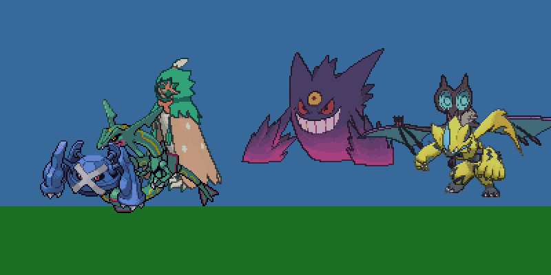

<!-- Daily Pokémon profile generated by scripts/build_readme.py -->
<h1 align="center">Arudchayan · BattleOps Command Center</h1>
<p align="center"><em>battle telemetry screaming through neon conduits</em></p>

<!-- TEAM_BANNER_PLACEHOLDER -->
<div align="center">
  
</div>

## 🧾 POKÉMON TRAINER PROFILE

| Signal | Readout |
| --- | --- |
| Generated | 2025-11-24 14:19 UTC |
| Schedule Index | 739579 |
| Archetype | Nightfall Rift Summoner |
| Lead Operative | Mega Gengar · Balanced Command Core |
| **Genetics Level** | **86** |
| Power Core | 3695 ([█████████████████████████░░░░░]  85.5% capacity) |
| Active Roster | Mega Gengar, Decidueye, Noivern, Rayquaza, Zeraora, Metagross |
| Unique Typings | 8 |
| Average Speed | 105.2 |

> Squad average speed: 105.2.

---

## ⚡ WEATHER REPORT: 🌧️ Rain
> **Field Condition:** Water moves boosted 50%, Fire moves weakened 50%.

---

## 📜 DAILY MISSION LOG
### **Quest:** Refactor legacy code to clear Gengar's Cursed Body status.

---

## 🛡️ TEAM CONFIGURATION

### 🧭 Rotation Hologram

<!-- CURRENT_ARCHETYPE_START -->
> **Rotation Profile:** Nightfall Rift Summoner
> **Command Lead:** Mega Gengar
<!-- CURRENT_ARCHETYPE_END -->

### Lead Strategy Module

**Primary Types:** 👻GHOST ☠️POISON
**Ability:** Shadow Tag
**Nature:** Timid
**Held Item:** Gengarite
**EV Spread:** 252 SpA / 4 SpD / 252 Spe
**Physical Specs:** 1.4m · 40.5kg

> **Genetics Boost:** Level 86 (Powered by 432 Contributions)

#### Stat Telemetry
```
HP:     [████░░░░░░░░░░░░░░░░]  60
ATK:    [█████████░░░░░░░░░░░] 115
DEF:    [██████████░░░░░░░░░░] 130
SP.ATK: [█████████████░░░░░░░] 170
SP.DEF: [███████████░░░░░░░░░] 145
SPEED:  [██████████░░░░░░░░░░] 130
```

#### Signature Arsenal
- **Shadow Ball** · 👻 Special · 80 BP
- **Protect** · ⚪ Status · Utility
- **Taunt** · 🌙 Status · Utility
- **Will O Wisp** · 🔥 Status · Utility

---

## 🧠 Coach's Corner
> **Coach's Analysis:** Simulating matchup vs **Hyper Offense** (Threat: **Iron Moth**). Your **Mega Gengar** outspeeds Iron Moth (Base 90). Strike first! Type matchup looks neutral or favorable. Press the advantage.

---

## 🗂️ Squad Dossiers

<details open>
<summary>⚔️ <strong>Mega Gengar</strong> · 👻GHOST / ☠️POISON</summary>

<div align="center">

<br/>
</div>

- **Base Stat Total:** 750
- **Top Stat:** Special-Attack (170)
- **Battle Role:** Unknown
- **Ability:** Shadow Tag
- **Nature:** Timid
- **Held Item:** Gengarite
- **EV Spread:** 252 SpA / 4 SpD / 252 Spe
- **Signature Moves:**
  - 👻 Shadow Ball · Special · 80 BP
  - ⚪ Protect · Status · Utility
  - 🌙 Taunt · Status · Utility
  - 🔥 Will O Wisp · Status · Utility
</details>

<details open>
<summary>⚔️ <strong>Decidueye</strong> · 🌿GRASS / 👻GHOST</summary>

<div align="center">

<br/>
</div>

- **Base Stat Total:** 530
- **Top Stat:** Attack (107)
- **Battle Role:** Unknown
- **Ability:** Overgrow
- **Nature:** Adamant
- **Held Item:** Leftovers
- **EV Spread:** 252 HP / 252 Atk / 4 Def
- **Signature Moves:**
  - 👻 Shadow Sneak · Physical · 40 BP
  - 🌙 Nasty Plot · Status · Utility
  - 🥊 Bulk Up · Status · Utility
  - ⚪ Protect · Status · Utility
</details>

<details open>
<summary>⚔️ <strong>Noivern</strong> · 🕊️FLYING / 🐉DRAGON</summary>

<div align="center">

<br/>
</div>

- **Base Stat Total:** 535
- **Top Stat:** Speed (123)
- **Battle Role:** Unknown
- **Ability:** Frisk
- **Nature:** Timid
- **Held Item:** Heavy-Duty Boots
- **EV Spread:** 252 SpA / 4 SpD / 252 Spe
- **Signature Moves:**
  - 🕊️ Hurricane · Special · 110 BP
  - ✨ Moonlight · Status · Utility
  - ⚪ Protect · Status · Utility
  - 🌙 Taunt · Status · Utility
</details>

<details open>
<summary>⚔️ <strong>Rayquaza</strong> · 🐉DRAGON / 🕊️FLYING</summary>

<div align="center">

<br/>
</div>

- **Base Stat Total:** 680
- **Top Stat:** Attack (150)
- **Battle Role:** Unknown
- **Ability:** Air Lock
- **Nature:** Mild
- **Held Item:** Heavy-Duty Boots
- **EV Spread:** 252 HP / 252 SpA / 4 SpD
- **Signature Moves:**
  - 🕊️ Dragon Ascent · Physical · 120 BP
  - 🕊️ Hurricane · Special · 110 BP
  - 🥊 Bulk Up · Status · Utility
  - ⚪ Protect · Status · Utility
</details>

<details open>
<summary>⚔️ <strong>Zeraora</strong> · ⚡ELECTRIC</summary>

<div align="center">

<br/>
</div>

- **Base Stat Total:** 600
- **Top Stat:** Speed (143)
- **Battle Role:** Unknown
- **Ability:** Volt Absorb
- **Nature:** Jolly
- **Held Item:** Expert Belt
- **EV Spread:** 252 Atk / 4 Def / 252 Spe
- **Signature Moves:**
  - ⚡ Plasma Fists · Physical · 100 BP
  - 🥊 Bulk Up · Status · Utility
  - 🔮 Calm Mind · Status · Utility
  - ⚪ Protect · Status · Utility
</details>

<details open>
<summary>⚔️ <strong>Metagross</strong> · ⚙️STEEL / 🔮PSYCHIC</summary>

<div align="center">

<br/>
</div>

- **Base Stat Total:** 600
- **Top Stat:** Attack (135)
- **Battle Role:** Unknown
- **Ability:** Clear Body
- **Nature:** Adamant
- **Held Item:** Leftovers
- **EV Spread:** 252 HP / 252 Atk / 4 Def
- **Signature Moves:**
  - ⚙️ Bullet Punch · Physical · 40 BP
  - ⚪ Protect · Status · Utility
  - 🪨 Stealth Rock · Status · Utility
  - 🌍 Earthquake · Physical · 100 BP
</details>

---

## 🧪 Type Coverage Broadcast

- 👻 **GHOST** ×2
- 🕊️ **FLYING** ×2
- 🐉 **DRAGON** ×2
- ☠️ **POISON** ×1
- 🌿 **GRASS** ×1
- ⚡ **ELECTRIC** ×1
- ⚙️ **STEEL** ×1
- 🔮 **PSYCHIC** ×1

---

## 🛡️ Defensive Analysis

### ⚠️ Critical Weaknesses (3+ Pokemon)
- 🧊 **ICE** threatens 5 team members
- 👻 **GHOST** threatens 3 team members
- 🌙 **DARK** threatens 3 team members
- 🌍 **GROUND** threatens 3 team members

### ⚡ Moderate Weaknesses (2 Pokemon)
- 🔥 **FIRE** hits 2 team members
- 🐛 **BUG** hits 2 team members
- ⚡ **ELECTRIC** hits 2 team members
- 🪨 **ROCK** hits 2 team members
- 🐉 **DRAGON** hits 2 team members
- ✨ **FAIRY** hits 2 team members

---

## 🌀 Dynamism Overlay

| Flux Channel | Status |
| --- | --- |
| Synergy Mesh | [▓▓▓▓▓▓▓▓▓▓▓▓▓▓▓▓▓▓]  100% · Ω-OVERDRIVE |
| Speed Pulse | [▓▓▓▓▓▓▓▓▓▓▓░░░░░░░]   58% · CRUISE |
| Apex Pressure | [▓▓▓▓▓▓▓▓▓▓▓▓▓▓▓▓▓▓]  100% · Ω-OVERDRIVE |

> Adaptive cadence engaged.

- **Synergy:** 8 types.
- **Speed:** Avg 105.2.

---

## 🏟️ Recent Challengers (Gym Leader Mode)
| Date | Challenger | Team | Result |
| --- | --- | --- | --- |
| 2025-11-24 | Gary Oak | Blastoise, Arcanine, Exeggutor | 3-0 (Arudchayan) |

---

## 📋 BATTLE SIMULATION LOG (Daily Drill)
```
⚔️ **Battle Start!** Trainer Nightfall Rift Summoner vs Rival Blue!
🔹 **Turn 1:** Mega Gengar Mega Evolves and uses **Dragon Ascent**!
🔸 Rival's Garchomp survives on Focus Sash and uses **Swords Dance**!
🔹 **Turn 2:** Mega Gengar uses **Extreme Speed** for the KO!
🔸 Rival sends out Tapu Koko. Electric Terrain activates!
🔹 **Turn 3:** Mega Gengar switches to Landorus-T to Intimidate!
🏆 **Result:** Rival forfeits! **Nightfall Rift Summoner Wins!**
```

## 📥 POKÉPASTE EXPORT
Copy this to import your team into Pokémon Showdown:
```
Mega Gengar @ Gengarite
Ability: Shadow Tag
EVs: 252 SpA / 4 SpD / 252 Spe
Timid Nature
- Shadow Ball
- Protect
- Taunt
- Will O Wisp

Decidueye @ Leftovers
Ability: Overgrow
EVs: 252 HP / 252 Atk / 4 Def
Adamant Nature
- Shadow Sneak
- Nasty Plot
- Bulk Up
- Protect

Noivern @ Heavy-Duty Boots
Ability: Frisk
EVs: 252 SpA / 4 SpD / 252 Spe
Timid Nature
- Hurricane
- Moonlight
- Protect
- Taunt

Rayquaza @ Heavy-Duty Boots
Ability: Air Lock
EVs: 252 HP / 252 SpA / 4 SpD
Mild Nature
- Dragon Ascent
- Hurricane
- Bulk Up
- Protect

Zeraora @ Expert Belt
Ability: Volt Absorb
EVs: 252 Atk / 4 Def / 252 Spe
Jolly Nature
- Plasma Fists
- Bulk Up
- Calm Mind
- Protect

Metagross @ Leftovers
Ability: Clear Body
EVs: 252 HP / 252 Atk / 4 Def
Adamant Nature
- Bullet Punch
- Protect
- Stealth Rock
- Earthquake
```

---

## ⚙️ Competitive Systems Matrix

| Mechanic | Status | Notes |
| --- | --- | --- |
| Mega Evolution | ◆ | Gengarite 💎 |
| Z-Move | ▲ | Never-Ending Nightmare ⚡ |
| Terastallization | ◇ | Ghost ✨ |

---

## 🎲 Encounter Terminal

<details open>
  <summary>🎲 Encounter: Zeraora</summary>

  <div align="center">
  
  </div>

  - **Rarity Signal:** Wild Encounter
  - **Type Signal:** ⚡ELECTRIC
  - **Height / Weight:** 1.5m · 44.5kg
  - **Abilities:** Volt Absorb
  - **Pokédex Insight:** It electrifies its claws and tears its opponents apart with them. Even if they dodge its attack, they’ll be electrocuted by the flying sparks.
  - **Encounter Telemetry:** Routine scouting ping—deploy capture drones at your discretion.

</details>

### ✨ Shiny Hunt Status
Current Hunt: **43** Days Dry. Odds: **23.58%**
Shiny status: Checked.

### 🔀 Click-to-Choose Battle Routes

<details>
  <summary>🌌 Path 1 — Starfall Ridge</summary>

  - **Battlefield State:** Meteor dust drifts across a gravity-light plateau.
  - **Encounter Twist:** Telemetry pings a sudden weather flux altering move potency.
  - **Command Brief:** Track the Wild-class target — Zeraora (wild signal).
  - **Type Intel:** Electric

  <details>
    <summary>🛰️ Call Orbital Survey Assist · 83% odds</summary>

    - **If it lands:** Satellite intel locks patterns, letting you predict every counter-move perfectly.
    - **If it whiffs:** A solar flare knocks the feed offline, leaving you momentarily exposed.
  </details>
  <details>
    <summary>🪬 Invoke Terrain Sync Protocol · 72% odds</summary>

    - **If it lands:** Terrain energy bends toward you, amplifying status plays that pacify the target.
    - **If it whiffs:** The sync desyncs, amplifying Zeraora's innate typing instead.
  </details>
</details>

<details>
  <summary>🌲 Path 2 — Verdant Overwatch</summary>

  - **Battlefield State:** Bioluminescent spores swirl between ancient trunks.
  - **Encounter Twist:** Wild support units stir in the periphery, ready to tip the balance.
  - **Command Brief:** Track the Wild-class target — Zeraora (wild signal).
  - **Type Intel:** Electric

  <details>
    <summary>🪬 Invoke Terrain Sync Protocol · 70% odds</summary>

    - **If it lands:** Terrain energy bends toward you, amplifying status plays that pacify the target.
    - **If it whiffs:** The sync desyncs, amplifying Zeraora's innate typing instead.
  </details>
  <details>
    <summary>🛰️ Call Orbital Survey Assist · 54% odds</summary>

    - **If it lands:** Satellite intel locks patterns, letting you predict every counter-move perfectly.
    - **If it whiffs:** A solar flare knocks the feed offline, leaving you momentarily exposed.
  </details>
</details>

<details>
  <summary>❄️ Path 3 — Aurora Chasm</summary>

  - **Battlefield State:** Iridescent ice mirrors every motion in prismatic streaks.
  - **Encounter Twist:** A rival operative shadows the encounter, eager to intercept your claim.
  - **Command Brief:** Track the Wild-class target — Zeraora (wild signal).
  - **Type Intel:** Electric

  <details>
    <summary>🛡️ Raise Reflective Barriers · 82% odds</summary>

    - **If it lands:** Screens crystallise, letting you pace the fight and open a safe capture window.
    - **If it whiffs:** Barrier harmonics misalign, giving Zeraora a free setup turn to escalate pressure.
  </details>
  <details>
    <summary>🛰️ Call Orbital Survey Assist · 72% odds</summary>

    - **If it lands:** Satellite intel locks patterns, letting you predict every counter-move perfectly.
    - **If it whiffs:** A solar flare knocks the feed offline, leaving you momentarily exposed.
  </details>
</details>

---

## 🗺️ Repository Flight Plan

| Area | Description | Key Files |
| --- | --- | --- |
| Daily build automation | Generates this README from live data and archetypes. | [`scripts/build_readme.py`](scripts/build_readme.py) |
| Archetype rotation | Curated roster definitions for each featured team. | [`data/archetypes.json`](data/archetypes.json) |
| Presentation layer | Markdown template for this command-center layout. | [`README.template.md`](README.template.md) |

---

## 🤝 Stay in Touch

- **GitHub:** [@Arudchayan](https://github.com/Arudchayan)
- **Collaboration:** Open to pairing on automation, data visualisation, or Pokémon-themed storytelling.
- **Status:** Always happy to connect—reach out via issues or pull requests.

---

<sub>README last rebuilt on 2025-11-24 14:19 UTC. Next rotation triggers at midnight UTC.</sub>
