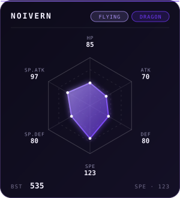
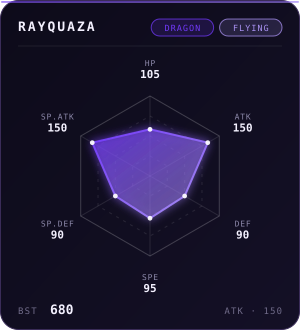
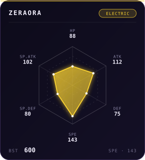
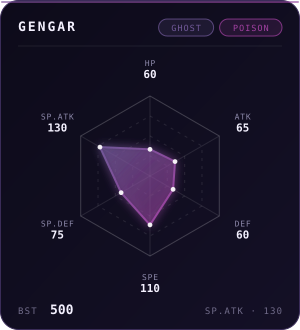
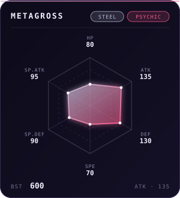
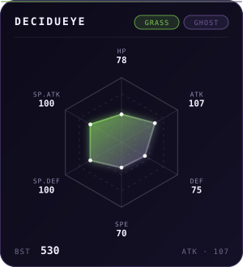

<!-- Daily Pokémon profile generated by scripts/build_readme.py -->
<h1 align="center">Arudchayan · BattleOps Command Center</h1>
<p align="center"><em>battle telemetry screaming through neon conduits</em></p>
<p align="center"><strong>ML research engineering · evals · reinforcement learning · reproducible systems</strong></p>
<p align="center"><sub>Pokémon trainer by night. Research engineer by day. Open to roles where rigorous evaluation matters.</sub></p>

## 🧾 POKÉMON TRAINER PROFILE

| Signal | Readout |
| --- | --- |
| Generated | 2026-11-16 06:02 UTC |
| Schedule Index | 739936 |
| Archetype | Ultrasonic Night Raider |
| Lead Operative | Noivern · Balanced Command Core |
| Power Core | 3445 ([███████████████████████░░░░░░░]  79.7% capacity) |
| Active Roster | Noivern, Rayquaza, Zeraora, Gengar, Metagross, Decidueye |
| Unique Typings | 8 |
| Average Speed | 101.8 |

<p align="center">     </p>

---

## ⚡ WEATHER REPORT: ❄️ Snow
> **Field Condition:** Ice types get 50% Def boost.

---

## 📜 DAILY MISSION LOG
### **Quest:** Push a commit before noon to outspeed Rival Weavile.

---

## 🛡️ TEAM CONFIGURATION

### 🧭 Rotation Hologram

> **Rotation Profile:** Ultrasonic Night Raider
> **Command Lead:** Noivern

### Lead Strategy Module

<div align="center"></div>

**Primary Types:** 🕊️FLYING 🐉DRAGON
**Ability:** Frisk
**Nature:** Timid
**Held Item:** Heavy-Duty Boots
**EV Spread:** 252 SpA / 4 SpD / 252 Spe
**Physical Specs:** 1.5m · 85.0kg

#### Stat Telemetry
```
HP:     [██████░░░░░░░░░░░░░░]  85
ATK:    [█████░░░░░░░░░░░░░░░] 70
DEF:    [██████░░░░░░░░░░░░░░] 80
SP.ATK: [███████░░░░░░░░░░░░░] 97
SP.DEF: [██████░░░░░░░░░░░░░░] 80
SPEED:  [█████████░░░░░░░░░░░] 123
```

#### Signature Arsenal
- **🕊️ Roost · Status · Utility**
- **🕊️ Defog · Status · Utility**
- **🐉 Dragon Dance · Status · Utility**
- **🕊️ Hurricane · Special · 110 BP**

---

## 🧠 Coach's Corner
> **Coach's Analysis:** Simulating matchup vs **Standard OU Offense** (Threat: **Landorus-Therian**). Your **Noivern** outspeeds Landorus-Therian (Base 91). Strike first! Type matchup looks neutral or favorable. Press the advantage.

---

## 🗂️ Squad Dossiers

<details open>
<summary>⚔️ <strong>Noivern</strong> · 🕊️FLYING / 🐉DRAGON</summary>

<div align="center">

<br/>
</div>

- **Base Stat Total:** 535
- **Top Stat:** Speed (123)
- **Ability:** Frisk
- **Nature:** Timid
- **Held Item:** Heavy-Duty Boots
- **EV Spread:** 252 SpA / 4 SpD / 252 Spe
- **Signature Moves:**
  - 🕊️ Roost · Status · Utility
  - 🕊️ Defog · Status · Utility
  - 🐉 Dragon Dance · Status · Utility
  - 🕊️ Hurricane · Special · 110 BP
</details>

<details open>
<summary>⚔️ <strong>Rayquaza</strong> · 🐉DRAGON / 🕊️FLYING</summary>

<div align="center">

<br/>
</div>

- **Base Stat Total:** 680
- **Top Stat:** Attack (150)
- **Ability:** Air Lock
- **Nature:** Mild
- **Held Item:** Heavy-Duty Boots
- **EV Spread:** 252 HP / 252 SpA / 4 SpD
- **Signature Moves:**
  - 🕊️ Dragon Ascent · Physical · 120 BP
  - 🐉 Dragon Dance · Status · Utility
  - 🕊️ Defog · Status · Utility
  - 🕊️ Hurricane · Special · 110 BP
</details>

<details open>
<summary>⚔️ <strong>Zeraora</strong> · ⚡ELECTRIC</summary>

<div align="center">

<br/>
</div>

- **Base Stat Total:** 600
- **Top Stat:** Speed (143)
- **Ability:** Volt Absorb
- **Nature:** Jolly
- **Held Item:** Life Orb
- **EV Spread:** 252 Atk / 4 Def / 252 Spe
- **Signature Moves:**
  - ⚡ Thunder Wave · Status · Utility
  - 🥊 Bulk Up · Status · Utility
  - 🔮 Calm Mind · Status · Utility
  - ⚪ Protect · Status · Utility
</details>

<details open>
<summary>⚔️ <strong>Gengar</strong> · 👻GHOST / ☠️POISON</summary>

<div align="center">

<br/>
</div>

- **Base Stat Total:** 500
- **Top Stat:** Special-Attack (130)
- **Ability:** Cursed Body
- **Nature:** Timid
- **Held Item:** Life Orb
- **EV Spread:** 252 SpA / 4 SpD / 252 Spe
- **Signature Moves:**
  - ☠️ Toxic · Status · Utility
  - ☠️ Toxic Spikes · Status · Utility
  - 👻 Shadow Ball · Special · 80 BP
  - ☠️ Sludge Wave · Special · 95 BP
</details>

<details open>
<summary>⚔️ <strong>Metagross</strong> · ⚙️STEEL / 🔮PSYCHIC</summary>

<div align="center">

<br/>
</div>

- **Base Stat Total:** 600
- **Top Stat:** Attack (135)
- **Ability:** Clear Body
- **Nature:** Adamant
- **Held Item:** Leftovers
- **EV Spread:** 252 HP / 252 Atk / 4 Def
- **Signature Moves:**
  - ⚙️ Bullet Punch · Physical · 40 BP
  - ⚪ Protect · Status · Utility
  - 🪨 Stealth Rock · Status · Utility
  - ⚪ Substitute · Status · Utility
</details>

<details open>
<summary>⚔️ <strong>Decidueye</strong> · 🌿GRASS / 👻GHOST</summary>

<div align="center">

<br/>
</div>

- **Base Stat Total:** 530
- **Top Stat:** Attack (107)
- **Ability:** Overgrow
- **Nature:** Adamant
- **Held Item:** Leftovers
- **EV Spread:** 252 HP / 252 Atk / 4 Def
- **Signature Moves:**
  - 🌿 Synthesis · Status · Utility
  - 👻 Shadow Sneak · Physical · 40 BP
  - 🌙 Nasty Plot · Status · Utility
  - 🥊 Bulk Up · Status · Utility
</details>

---

## 🧪 Type Coverage Broadcast

- 🕊️ **FLYING** ×2
- 🐉 **DRAGON** ×2
- 👻 **GHOST** ×2
- ⚡ **ELECTRIC** ×1
- ☠️ **POISON** ×1
- ⚙️ **STEEL** ×1
- 🔮 **PSYCHIC** ×1
- 🌿 **GRASS** ×1

---

## 🛡️ Defensive Analysis

### ⚠️ Critical Weaknesses (3+ Pokemon)
- 🧊 **ICE** threatens 5 team members
- 🌍 **GROUND** threatens 3 team members
- 👻 **GHOST** threatens 3 team members
- 🌙 **DARK** threatens 3 team members

### ⚡ Moderate Weaknesses (2 Pokemon)
- ⚡ **ELECTRIC** hits 2 team members
- 🪨 **ROCK** hits 2 team members
- 🐉 **DRAGON** hits 2 team members
- ✨ **FAIRY** hits 2 team members
- 🔥 **FIRE** hits 2 team members
- 🐛 **BUG** hits 2 team members

---

## 🌀 Dynamism Overlay

| Flux Channel | Status |
| --- | --- |
| Synergy Mesh | [▓▓▓▓▓▓▓▓▓▓▓▓▓▓▓▓▓▓]  100% · Ω-OVERDRIVE |
| Speed Pulse | [▓▓▓▓▓▓▓▓▓▓░░░░░░░░]   57% · CRUISE |
| Apex Pressure | [▓▓▓▓▓▓▓▓▓▓▓▓▓▓▓▓▓░]   94% · Ω-OVERDRIVE |

> Adaptive cadence engaged.

---

## 🏟️ Recent Challengers (Gym Leader Mode)
| Date | Challenger | Team | Result |
| --- | --- | --- | --- |
| 2026-08-25 | TestTrainer | Pikachu, Charizard, Mewtwo | 3-0 (Arudchayan) |
| 2025-11-24 | Gary Oak | Blastoise, Arcanine, Exeggutor | 3-0 (Arudchayan) |

---

## 📋 BATTLE SIMULATION LOG (Daily Drill)
```
⚔️ **Battle Start!** Trainer Ultrasonic Night Raider vs Rival Blue!
🔹 **Turn 1:** Noivern opens with **Hurricane**!
🔸 Rival's Garchomp survives on Focus Sash and uses **Swords Dance**!
🔹 **Turn 2:** Noivern answers with **a coverage move** for the KO!
🔸 Rival sends out Tapu Koko. Electric Terrain activates!
🔹 **Turn 3:** Noivern pivots to Rayquaza to reset the tempo!
🏆 **Result:** Rival forfeits! **Ultrasonic Night Raider Wins!**
```

## 📥 POKÉPASTE EXPORT
Copy this to import your team into Pokémon Showdown:
```
Noivern @ Heavy-Duty Boots
Ability: Frisk
EVs: 252 SpA / 4 SpD / 252 Spe
Timid Nature
- Roost
- Defog
- Dragon Dance
- Hurricane

Rayquaza @ Heavy-Duty Boots
Ability: Air Lock
EVs: 252 HP / 252 SpA / 4 SpD
Mild Nature
- Dragon Ascent
- Dragon Dance
- Defog
- Hurricane

Zeraora @ Life Orb
Ability: Volt Absorb
EVs: 252 Atk / 4 Def / 252 Spe
Jolly Nature
- Thunder Wave
- Bulk Up
- Calm Mind
- Protect

Gengar @ Life Orb
Ability: Cursed Body
EVs: 252 SpA / 4 SpD / 252 Spe
Timid Nature
- Toxic
- Toxic Spikes
- Shadow Ball
- Sludge Wave

Metagross @ Leftovers
Ability: Clear Body
EVs: 252 HP / 252 Atk / 4 Def
Adamant Nature
- Bullet Punch
- Protect
- Stealth Rock
- Substitute

Decidueye @ Leftovers
Ability: Overgrow
EVs: 252 HP / 252 Atk / 4 Def
Adamant Nature
- Synthesis
- Shadow Sneak
- Nasty Plot
- Bulk Up
```

---

## ⚙️ Competitive Systems Matrix

| Mechanic | Loadout |
| --- | --- |
| Mega Evolution | — |
| Z-Move | ▲ Supersonic Skystrike ⚡ |
| Terastallization | ◇ Flying ✨ |

---

## 🎲 Encounter Terminal

<details open>
  <summary>🎲 Encounter: Tyranitar</summary>

  <div align="center">
  
  </div>

  - **Rarity Signal:** Wild Encounter
  - **Type Signal:** 🪨ROCK 🌙DARK
  - **Height / Weight:** 2.0m · 202.0kg
  - **Abilities:** Sand Stream, Unnerve
  - **Pokédex Insight:** Its body can't be harmed by any sort of attack, so it is very eager to make challenges against enemies.
  - **Encounter Telemetry:** Routine scouting ping—deploy capture drones at your discretion.

</details>

### ✨ Shiny Hunt Status
Current Hunt: **50** Days Dry. Odds: **2.08**

### 🔀 Click-to-Choose Battle Routes

<details>
  <summary>🌌 Path 1 — Starfall Ridge</summary>

  - **Battlefield State:** Meteor dust drifts across a gravity-light plateau.
  - **Encounter Twist:** Wild support units stir in the periphery, ready to tip the balance.
  - **Command Brief:** Track the Wild-class target — Tyranitar (wild signal).
  - **Type Intel:** Rock / Dark

  <details>
    <summary>🪬 Invoke Terrain Sync Protocol · 77% odds</summary>

    - **If it lands:** Terrain energy bends toward you, amplifying status plays that pacify the target.
    - **If it whiffs:** The sync desyncs, amplifying Tyranitar's innate typing instead.
  </details>
  <details>
    <summary>🛡️ Raise Reflective Barriers · 58% odds</summary>

    - **If it lands:** Screens crystallise, letting you pace the fight and open a safe capture window.
    - **If it whiffs:** Barrier harmonics misalign, giving Tyranitar a free setup turn to escalate pressure.
  </details>
</details>

<details>
  <summary>🌋 Path 2 — Magma Corridor</summary>

  - **Battlefield State:** Vents pulse underfoot with primal, red-hot rhythm.
  - **Encounter Twist:** Telemetry pings a sudden weather flux altering move potency.
  - **Command Brief:** Track the Wild-class target — Tyranitar (wild signal).
  - **Type Intel:** Rock / Dark

  <details>
    <summary>🪬 Invoke Terrain Sync Protocol · 71% odds</summary>

    - **If it lands:** Terrain energy bends toward you, amplifying status plays that pacify the target.
    - **If it whiffs:** The sync desyncs, amplifying Tyranitar's innate typing instead.
  </details>
  <details>
    <summary>🛡️ Raise Reflective Barriers · 78% odds</summary>

    - **If it lands:** Screens crystallise, letting you pace the fight and open a safe capture window.
    - **If it whiffs:** Barrier harmonics misalign, giving Tyranitar a free setup turn to escalate pressure.
  </details>
</details>

<details>
  <summary>❄️ Path 3 — Aurora Chasm</summary>

  - **Battlefield State:** Iridescent ice mirrors every motion in prismatic streaks.
  - **Encounter Twist:** Command authorises prototype gear if you can stall three turns.
  - **Command Brief:** Track the Wild-class target — Tyranitar (wild signal).
  - **Type Intel:** Rock / Dark

  <details>
    <summary>🛡️ Raise Reflective Barriers · 73% odds</summary>

    - **If it lands:** Screens crystallise, letting you pace the fight and open a safe capture window.
    - **If it whiffs:** Barrier harmonics misalign, giving Tyranitar a free setup turn to escalate pressure.
  </details>
  <details>
    <summary>🎯 Deploy Quick Ball Salvo · 83% odds</summary>

    - **If it lands:** The wild signal is secured in a double-shake snap while cheers erupt across comms.
    - **If it whiffs:** Tyranitar slips free in a burst of light, boosting its Evasion and tempo.
  </details>
</details>

---

## 🧪 Other Public Projects

Selected work outside this trainer card:

| Project | What it is | Stack |
| --- | --- | --- |
| [**TraceScope**](https://github.com/Arudchayan/TraceScope) | Small-LM safety-monitor evals: judge seed variance, prompt brittleness, and embedding-monitor transfer limits. | Python · evals |
| [**AgentGate**](https://github.com/Arudchayan/AgentGate) | Enforcement gate for agent file/email actions: allowlists, sensitive-pattern confirms, and measured block/legit rates. | Python · security |
| [**NSCLC360**](https://github.com/Arudchayan/NSCLC360) | XAI-based prognosis research for non-small-cell lung cancer, with a focus on biomarker discovery. | Python · medical AI |
| [**Auto-Scientist**](https://github.com/Arudchayan/Auto-Scientist) | Autonomous scientific discovery agent with a streaming literature → tools → mini-paper workflow. | TypeScript · LLM agents |
| [**ResearchQuest**](https://github.com/Arudchayan/ResearchQuest) | A scholarly workspace for papers, notes, ideas, topics, and focus sessions. | TypeScript · Supabase |
| [**Turnwave**](https://github.com/Arudchayan/Turnwave) | Local speech-to-speech assistant with interruption handling. | Python · audio |

More experiments and side quests: [github.com/Arudchayan](https://github.com/Arudchayan?tab=repositories).

---

## 🗺️ How This Works

The README is rebuilt daily by [`scripts/build_readme.py`](scripts/build_readme.py) (GitHub Action: `.github/workflows/update-readme.yml`, midnight UTC + manual trigger). It picks a team from [`data/archetypes.json`](data/archetypes.json), fetches live stats from PokéAPI, renders it through [`README.template.md`](README.template.md), and commits the result. Issues titled `Challenge @...` trigger `.github/workflows/challenge.yml`, which simulates a gym battle via `scripts/process_challenge.py`.

---

## 🤝 Stay in Touch

- **GitHub:** [@Arudchayan](https://github.com/Arudchayan)
- **Open to:** research engineering, ML systems, evaluation, and reinforcement learning roles.
- **Collaboration:** Pairing on automation, data visualisation, evals, or Pokémon-themed storytelling.
- **Status:** Always happy to connect. Reach out via issues, discussions, or a pull request.

---

<sub>README last rebuilt on 2026-11-16 06:02 UTC. Next rotation triggers at midnight UTC.</sub>
